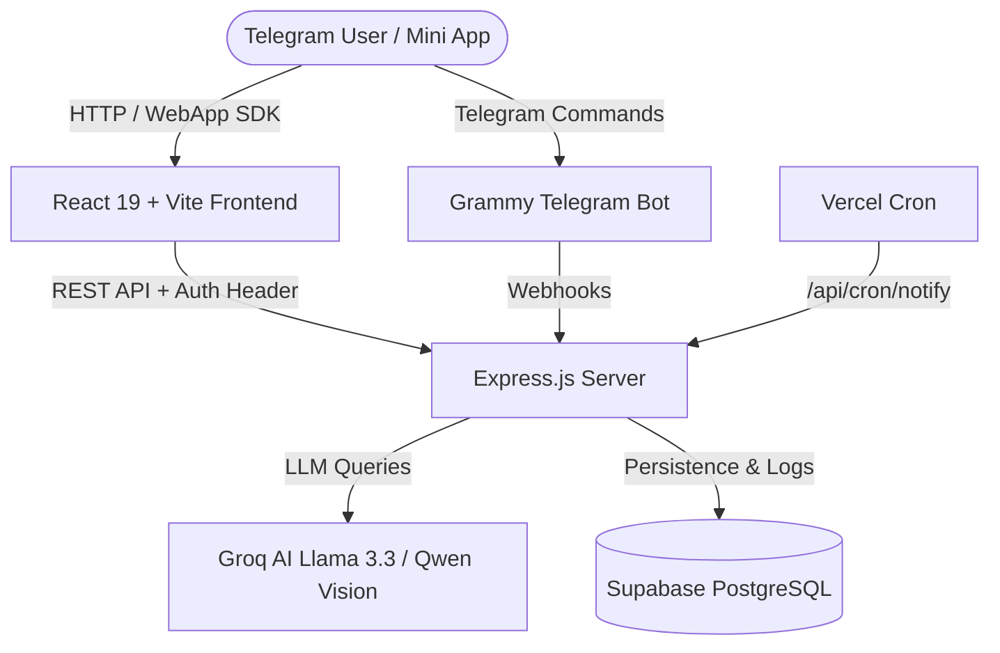

# Appy (GainTracker) 🍏⚡

[](https://react.dev/)
[](https://nodejs.org/)
[](https://vitejs.dev/)
[](https://tailwindcss.com/)
[](https://groq.com/)
[](https://supabase.com/)
[](https://github.com/qutlawsoasis-debug/newTracker/releases)
[](CODE_OF_CONDUCT.md)
[](LICENSE)

> **Appy** is an intelligent, high-performance Telegram Mini App designed for automated calorie tracking, AI-powered meal planning, and nutrition coaching. It combines personalized BMR calculations, vision-based food recognition, and localized supermarket product recommendations (Germany & CIS regions) into a seamless mobile web application.

---

## ✨ Features

- 🍏 **Smart AI Daily Meal Planner**: Generates balanced daily meal plans (Breakfast, Lunch, Dinner, Snack) tailored to individual Mifflin-St Jeor BMR targets and macro goals (Protein, Fat, Carbs).
- 📸 **Vision AI Food Recognition**: Scan photos of meals to automatically extract dish names, estimated calories, and macro breakdown using high-resolution Vision LLMs.
- 💬 **Interactive AI Coach ("Appy")**: Personable AI nutrition mentor that tracks meal completion, provides feedback, and enforces daily free/premium limits.
- 🏪 **Localized Supermarket Alternatives**: One-tap replacement of home-cooked recipes with ready-to-eat products tailored to user region (REWE, ALDI, LIDL for Germany; Пятёрочка, Магнит, ВкусВилл for CIS).
- 🔄 **Single-Meal Reroll**: Instantly swap out specific meals without regenerating the entire daily plan.
- 📊 **Streak & Progress Tracking**: Daily streak counter, weight history graphing, and macro progress bars.
- ⭐️ **Telegram Stars Integration**: Seamless Telegram Stars payments for Premium tier unlocks (unlimited AI chat, menu rerolls, and supermarket alternatives).
- ⏰ **Automated Serverless Notifications**: Vercel Cron-driven meal reminder notifications tailored to individual user schedules.

---

## 🛠 Tech Stack & Architecture

### **Frontend**
- **Framework**: React 19 + Vite
- **Styling**: TailwindCSS + Lucide Icons
- **Platform**: Telegram WebApp SDK (`@twa-dev/sdk`)

### **Backend**
- **Runtime**: Node.js + Express.js
- **Database & Auth**: Supabase (PostgreSQL, Realtime, Auth, Row Level Security)
- **Telegram Bot Engine**: Grammy (`grammy`)
- **AI Acceleration**: Groq SDK (`groq-sdk`) utilizing `llama-3.3-70b-versatile` & `qwen/qwen3.6-27b`

### **Testing & CI/CD**
- **Unit Testing**: Vitest
- **E2E Automation**: Playwright Test Suite (Chromium Mobile)
- **Deployment**: Vercel Serverless Architecture

---

## 🚀 Quick Start

### Prerequisites
- Node.js >= 18.x
- npm >= 9.x
- Supabase Project & Groq API Key

### 1. Clone the repository
```bash
git clone https://github.com/qutlawsoasis-debug/newTracker.git
cd newTracker
```

### 2. Install dependencies
```bash
npm install
```

### 3. Environment Configuration
Create a `.env` file in the root directory:
```env
PORT=3000
SUPABASE_URL=https://your-supabase-project.supabase.co
SUPABASE_ANON_KEY=your-supabase-anon-key
GROQ_API_KEY=gsk_your_groq_api_key
TELEGRAM_BOT_TOKEN=your_telegram_bot_token
ADMIN_CHAT_ID=your_telegram_id
```

### 4. Run Locally
```bash
# Start local server
npm run start

# In another terminal, start Vite dev server
npm run dev
```

---

## 🧪 Testing

```bash
# Run unit test suite (Vitest)
npm test

# Run End-to-End test suite (Playwright)
npm run test:e2e

# Build for production
npm run build
```

---

## 🗺 System Architecture Diagram



---

## 📄 License

This project is licensed under the [MIT License](LICENSE).
